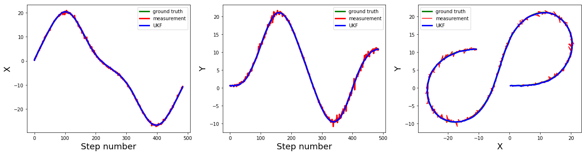
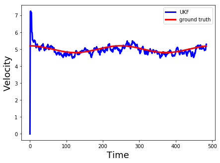
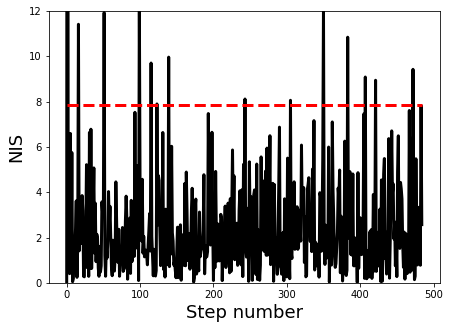

# Unscented Kalman Filter Project Starter Code
Self-Driving Car Engineer Nanodegree Program

In this project I utilized Unscented Kalman Filter (UKF) to estimate the state of a moving object of interest with noisy lidar and radar measurements. The code also calculates the RMSE values for the estimated state variables. 

This project uses the Term 2 Simulator which can be downloaded [here](https://github.com/udacity/self-driving-car-sim/releases)

## Files in this repository

`src`: The folder containing the source codes:
* `main.cpp`: The main file to read data, call UKF functins to process data and estimate states and calculate RMSE. Also, it creats an output file with the state variables, ground truth and measrument values. 
* `UKF.cpp`: Initializes the sates, calls the Unscented Kalman Filter predict and update functions.
* `tools.cpp`: Contains functions for caliclating Jacobian matrix and RMSE.

`data`: A forlder containing the sensor data

## How to run the codes

1. Clone this repo.
2. Make a build directory: `mkdir build && cd build`
3. Compile: `cmake .. && make` 
4. Run the file: `./ExtendedKF`. 

## Sensor fusion algorithm
I followed the Unscented Kalman Filter algorithm to predict and update based on measruments from Radar and Lidar sensors. The predict function is the same for either measruments while the update is different for Lidar and Radar measurements. Both Lidar and Radar is based on the Unscented Kalman Filter formulas with sigma points.

## Results
Here I plot the X,Y position estimations using UKF, measrument values and ground truth. The UKF results are matching the ground truth very well. 

Also, I plotted the estimated velocity and ground truth velocity. The estimations start from the initial velocity that I selected to be 0, and quickly converges around the fround truth velocity.  

In order to tune the process noise values, standard deviation longitudinal and yaw acceleration `std_a_` and `std_yawdd_`, I looked at the NIS values as shown next. The 95% line for the NIS values with 5 state variables is also shown with red line. The results shows that most NIS values are in the acceptable range.

The final state estimation [px, py, vx, vy] RMSE with both sensors was reported to be [0.0821, 0.0877, 0.3674, 0.2693] which satisfies the project expection of [.09, .10, .40, .30]. This RMSE results are better than the estimations using Extended Kalman Filter reported in the previous project [0.0964, 0.0852, 0.4151, 0.4313]. Here is the last frame of simulation in the simulator window with the calculated RMSE: 

I also tried using only one of the sensors to estimate the states that showed lower RMSE results. However, as mentioned before using both sensors results in lower RMSE that shows the power of sensor fusion using Kalman Filter.  

